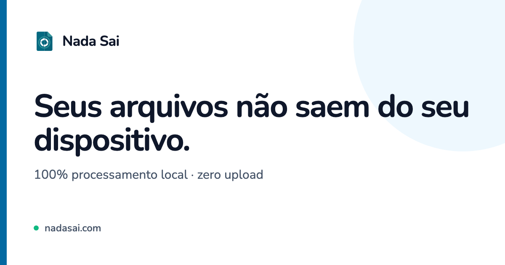

<p align="center">
  
</p>

<h1 align="center">Nada Sai</h1>

<p align="center">
  <a href="https://github.com/Luckas-Ferreira/nadasai/actions/workflows/ci.yml"></a>
  <a href="LICENSE"></a>
  
  
</p>

<p align="center">
  <a href="https://nadasai.com"><b>nadasai.com</b></a> ·
  <a href="https://nadasai.com/pt/sobre">sobre</a> ·
  <a href="https://nadasai.com/pt/privacidade">privacidade</a> ·
  <a href="https://nadasai.com/en">English</a>
</p>

---

Caixa de ferramentas de arquivo que roda inteira no navegador. **Não há backend.**
57 ferramentas em seis módulos — imagem, PDF, áudio, vídeo e privacidade —, todas
executando em WebAssembly, Web Workers e Canvas na máquina de quem usa. Nenhum
arquivo sai do dispositivo, e essa é a tese do produto, não um detalhe de rodapé.

O site é bilíngue: cada ferramenta existe sob `/pt` e sob `/en`, com URL própria
em cada idioma. Este repositório é documentado em português porque os comentários
do código são — mas issue e pull request em inglês são bem-vindos.

## O que garante a promessa

Três camadas, e nenhuma delas é declaração de intenção:

| | |
|---|---|
| **Sem backend** | A saída do build são arquivos estáticos e nada mais. Não existe servidor para o arquivo chegar. |
| **CSP** | `connect-src 'self' data: blob:` em `public/_headers`. Uma dependência com telemetria não consegue enviar o arquivo — o navegador barra antes. |
| **Medidor** | `NetworkProbeService` instrumenta fetch/XHR/sendBeacon/WebSocket e conta saída de ARQUIVO. A leitura fica na barra do topo, em toda rota, ao vivo. |

E, por consequência, o app funciona offline: é uma PWA com service worker, e
depois do primeiro carregamento dá para tirar o cabo da tomada e continuar
convertendo, assinando e criptografando.

## Rodar

```bash
npm ci          # o postinstall baixa o modelo de IA (42 MB) e o tessdata (~4 MB)
npm start       # ng serve -> http://localhost:4200
```

O `npm ci` é obrigatório antes do primeiro `start` ou `build`: `public/model/` e
`public/tessdata/` não são versionados e são baixados por `scripts/fetch-*.mjs`.
Sem eles, a remoção de fundo e o OCR dão 404 nos próprios pesos.

## Comandos

```bash
npm run build                # produção -> dist/nadasai, com prerender de 88 rotas
npm test                     # Karma + Jasmine no Chrome (modo watch)
npm test -- --watch=false --browsers=ChromeHeadless   # execução única, como no CI
npm run check:templates      # i18n e rótulo acessível nos templates
npm run e2e                  # Playwright, com janela visível
npm run e2e -- 04-convert    # um arquivo de spec
npm run og                   # regera os cards sociais e os ícones da PWA
```

**Não há linter nem formatador.** O `tsc` sob `strict` + `strictTemplates`, os
679 testes unitários, as 48 suítes de e2e e o `check:templates` são o portão
inteiro. Não invente um passo de lint — siga o estilo do arquivo ao lado.

## Como está organizado

```
src/app/
  core/       imagem, pdf, áudio, vídeo, gif, cripto, exif, hash, qr, texto, seo
              — lógica pura, testada em unidade, sem UI
  features/   uma pasta por ferramenta: componente + serviço sem estado
  shared/ui/  o kit compartilhado (dropzone, painel, barra de ações, alerta…)
scripts/      geradores e verificadores que rodam no prebuild e no CI
e2e/          Playwright, com as fixtures sintetizadas em tempo de execução
```

Uma sessão de trabalho só (`WorkspaceService`) atravessa o produto inteiro: o
resultado de uma ferramenta entra na próxima sem passar pelo disco, e `accepts` /
`produces` em `core/tools/tools.ts` é o que define quais encadeamentos existem.

## Contribuir

O guia é o [`CONTRIBUTING.md`](CONTRIBUTING.md): como rodar, o que reprova um PR
(não há linter — o portão é `tsc` estrito, os testes e o `check:templates`) e o
que precisa de conversa antes, como dependência nova ou qualquer coisa que peça
servidor.

A documentação de verdade é o [`CLAUDE.md`](CLAUDE.md). Ele não é um resumo da
arquitetura — é o registro de por que cada decisão está de pé, quase sempre
nomeando o defeito que a linha existe para impedir. Registrar uma ferramenta nova
toca sete lugares, e pular qualquer um deles é bug silencioso, não erro de
compilação: a lista está lá.

Todo pull request passa por um [CLA](CLA.md), conferido por um bot. Você continua
dono do seu código; a concessão é não exclusiva, e existe para que a licença possa
mudar no futuro sem precisar caçar a autorização de cada pessoa que já contribuiu.

**Falha de segurança não vai em issue.** O canal é o relato privado da aba
Security — veja [`SECURITY.md`](SECURITY.md).

## Licença

**AGPL-3.0** — veja [`LICENSE`](LICENSE). Você pode usar, estudar, modificar e
redistribuir, inclusive **comercialmente**; o que a licença exige é que qualquer
versão modificada que você distribua, ou sirva por rede, saia sob a mesma
licença e com o código-fonte aberto.

O que é redistribuído junto está em
[`THIRD-PARTY-LICENSES.md`](THIRD-PARTY-LICENSES.md). Duas entradas valem
menção aqui, porque as duas são armadilha de uso comercial:

- **O modelo IS-Net** da remoção de fundo é Apache-2.0 e é baixado em tempo de
  instalação. Não o troque por um checkpoint RMBG/BRIA — a licença deles é
  **não comercial**. Ver `scripts/fetch-model.mjs`.
- **`@breezystack/lamejs`**, o codificador de MP3, é **LGPL-3.0**, e é a única
  dependência copyleft do produto. Sob a AGPL isso não custa nada, porque a
  fonte aberta já satisfaz o direito de religar que a LGPL exige. Numa eventual
  versão fechada, custaria.

### A marca não está na licença

**"Nada Sai", o logotipo e o domínio `nadasai.com` são marca, e não estão
cobertos pela AGPL-3.0.** A licença entrega o código; ela não entrega o direito
de publicar um app ou um site com este nome e esta identidade visual, nem de
apresentar uma versão derivada como se fosse a oficial.

Fork é bem-vindo — sob outro nome.
